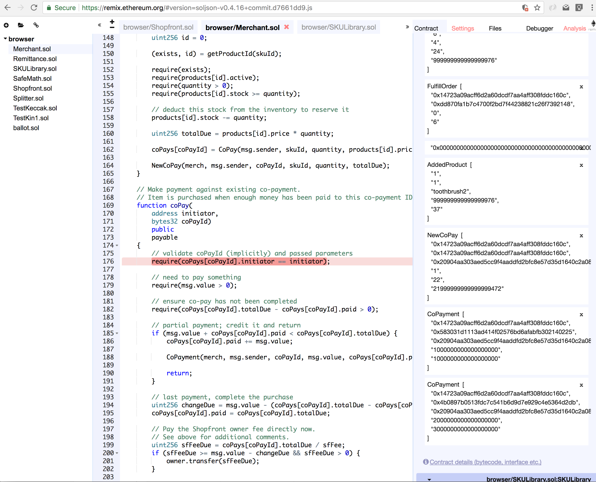

# Consensys Academy: Shopfront

## Usage

Checkout the repo into a directory called `jeff`. Use the `--recursive` flag to pull in the [easy-geth-dev-mode](https://github.com/curvegrid/easy-geth-dev-mode) submodule for running a private testnet.

```sh
git clone --recursive git@github.com:shoenseiwaso/ConsensysAcademy.git ./jeff
```

Launch the private test network in one terminal.

```sh
$ cd jeff/Shopfront
$ ./launch-testnet.sh
```

## Summary

Given time constraints for this project, I did not implement stretch goals of cross-token payment nor any sort of web interface. Co-payment by multiple parties, merchant contracts and a separate SKU library are implemented in a hub/spoke model.

The contracts were tested manually via Remix. See below for a sample screenshot of product addition and co-payment events firing.



## Architecture

The Shopfront is divided up into a series of smart contracts as follows.

* **[Shopfront.sol](https://github.com/shoenseiwaso/ConsensysAcademy/blob/master/Shopfront/contracts/Shopfront.sol)**: the master contract. Spawns merchant and SKU library contracts.
* **[SKULibrary.sol](https://github.com/shoenseiwaso/ConsensysAcademy/blob/master/Shopfront/contracts/SKULibrary.sol)**: central library of products. Owner and merchants can add and remove products.
* **[Merchant.sol](https://github.com/shoenseiwaso/ConsensysAcademy/blob/master/Shopfront/contracts/Merchant.sol)**: merchant contract spawned by Shopfront master. Sends a slice of each sale back to master Shopfront contract.

## Base requirements: Shopfront

The project will start as a database whereby:
- [x] as an administrator (or merchant), you can add products, which consist of an id, a price and a stock.
- [x] as a regular user you can buy 1 of the products.
- [x] as the owner you can make payments or withdraw value from the contract.

Eventually, you will refactor it to include:
- [x] ability to remove products.
- [x] co-purchase by different people.
- [x] add merchants akin to what Amazon has become.
- [ ] add the ability to pay with a third-party token.

## Stretch goals: Shopfront

### Hub and spoke
We have a hunch that you started with a single contract that does it all. How about you now move to a hub and spoke model?

- [x] The hub would deploy the spokes
- [x] Either the spokes send a sliver of the payment to the hub
- [x] How about a central sku repository for the shop(s)?

### Portability
Make your HTML and Javascript portable so that it works:

- [ ] in a regular browser, with a local Geth
- [ ] in Mist
- [ ] with Metamask and a public Geth